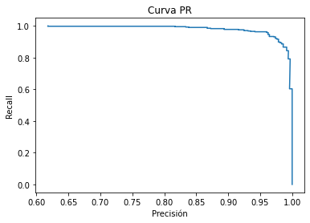
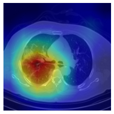

# Deep Learning for COVID19 detection in CT images 

This is a classificator to detect signs of SARS-CoV-2 pneumonia in chest CT scans. It is the first step of a major pipeline, currently under development, intended to analyze the existence, distribution, and extension of the typical radiological findings of Covid19 such as ground-glass opacification, pleural effusion, and consolidation.

# Dataset

The model was trained with labeled Covid19 and normal images from the database in [1] after converting them to NIfTI format. The figure shows an example of a normal subject (left) and an infected subject exhibiting the typical ground-glass pattern (right).

   

A total number of 108 subjects was included (54 normal and 54 Covid19). Each image is a slice of a CT volume that consists of approximately 200 slices. Images positives for Covid19 were labeled by experts as explained in [1]. Normal images are sampled uniformly form a volume of a normal patient. The slice distribution on normal and Covid19 images is shown in next figure where  is the normalized position of the slice, i.e.  is the first slice and  the last one.

 

   

Covid19 slices exhibit a normal distribution whereas normal slices are more uniformly distributed. The table summarizes the distribution of samples in each dataset. There is no patient overlap among sets. 

Set| Number of samples | Covid19 [%]
--- | --- | ---
Training | 5318| 50
Validation | 1486| 48
Test | 755| 53

# Model

The model was developed in Keras/Tensorflow.
Architecture: DenseNet121 with a sigmoid activation layer that represents the probability of being positive for Covid19. The configuration was inspired in [2] where it was shown to be efficient for X-ray classification. The final model had more than seven million of trainable parameters. 

# Training

The model was trained on a NVIDIA GeForce GTX 1650 Ti GPU. A validation set was used to monitor the progress of the training, for instance the learning rate was adapted when the accuracy on the validation set plateaued.
 
Setting | Value
--- | --- 
Loss function | binary crossentropy
Epochs | 20
Learning rate | 0.00005 (adaptive)
Optimizer | Adam
 

# Performance

The table shows the outcomes of the assessment on the testing set, figure shows the ROC curve.

Metric | Value
--- | --- 
True positives | 399
True negatives | 284
False positives | 4
False negatives | 65
Accuracy | 0.91
Loss | 0.21
Misclassification rate |  0.09
AUC | 0.99

  

<!-- Para las TACs mostradas arriba (extraídas del conjunto de testeo) las probabilidades predichas son P=0.9993 para el caso positivo y P=0.0260 para el caso negativo. 

 <a name="myfootnote1">1</a>: La cantidad es insuficiente para asegurar los resultados pero se prevé aumentar los datos de entrenamiento.
 
 
  -->
# Heatmaps

Heatmaps provide information on the regions of the image that activate the neural network [3]. Figure shows two Covid19 positive scans (row 1) and their respective heatmaps (row 2). While in the first case the involvement of the lung is left dominant, in the other case the right lung seems to be more affected.

  
   
  
  
  
  
  

 

 Let  be the heatmap where . Quantities  and   are defined as

 
 
 
 
<!--   -->
 
where  is the indicator function on set  ,  and  denote the support of the left and right lungs respectively. These integrals can be numerically calculated using masks for left and right lungs (row 3) obtained using the AI-based tool for lung segmentation in [4]. For the images shown, values are:  and   for the first column (left dominant) and
 and   for the second (right dominant). 

# Remarks

This is just an example of how DL tools can be used to classify CT scans for further analysis. It´s not a diagnosis tool. Some of the issues that are necessary to address for developing a suitable tool for diagnosis are discussed in [5].

# References
[1] Afshar, P., Heidarian, S., Enshaei, N. et al. COVID-CT-MD, COVID-19 computed tomography scan dataset applicable in machine learning and deep learning. Sci Data 8, 121 (2021). https://doi.org/10.1038/s41597-021-00900-3

[2] Pranav Rajpurkar, Jeremy Irvin ,Robyn L. Ball,Kaylie Zhu et al. Deep learning for chest radiograph diagnosis: A retrospective comparison of the CheXNeXt algorithm to practicing radiologists PLOS Medicine, November 2018.
https://dx.plos.org/10.1371/journal.pmed.1002686=

[3] R. Selvaraju, M. Cogswell, A. Das, R. Vedantam, D. Parikh, D. Batra. Grad-CAM: Visual Explanations from Deep Networks via Gradient-Based Localization, International Journal of Computer Vision, Springer Nature 2019. https://doi.org/10.1007/s11263-019-01228-7

[4] https://github.com/JoHof/lungmask

[5] M. Roberts et al. Common pitfalls and recommendations for using machine learning to detect and prognosticate for COVID-19 using chest radiographs and CT scans, Nature Machine Intelligence, 2021. https://doi.org/10.1038/s42256-021-00307-0

