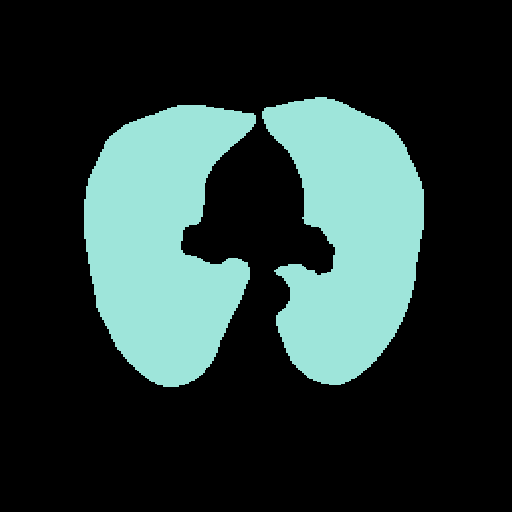
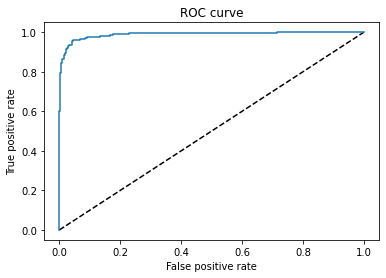

# Algoritmos Deep Learning para el estudio de Covid19 en imágenes de TAC de tórax. 

Acá se presenta un resultado preliminar: una etapa básica de un pipeline mayor donde se identifican los cortes tomográficos que exhiben lesiones de Covid19. El objetivo final del pipeline, actualmente en desarrollo, es la cuantificación de la extensión de los distintos tipos de lesiones características de la neumonía por SARS-CoV-2 (Ground-glass opacification, pleural effusion, consolidation, etc.) mediante el uso de técnicas de segmentación.

# Dataset

El modelo fue entrenado con cortes tomográficos axiales extraídos de la base de datos [1], la información de los pacientes fue debidamente eliminada de acuerdo con los protocolos de imágenes médicas. En las imágenes se muestran dos cortes de pacientes diferentes. La columna izquierda corresponde a una paciente normal mientras las imágenes a la derecha exhiben el patrón típico de la neumonía por Covid19: opacidades tipo vidrio esmerilado de predominio periférico. La primera fila muestra la imagen original, la segunda fila la máscara multiplicativa para la segmentación y la tercera fila muestra la imagen segmentada. La máscara se usa para la segmentación de manera de conservar solo los pixeles correspondientes los pulmones.

  
   
  
  
  
  
  

# Modelo

El modelo se confeccionó con la API de Keras. La arquitectura consiste en una DenseNet121 con una capa de salida con una activación sigmoidea y entrega la probabilidad de que la imagen sea positiva para Covid19. La arquitectura se inspiró en [2] donde se demostró la eficacia de estas configuraciones para la clasificación multiclase, i.e. varias patologías, de radiografías de tórax. Previo a la clasificación, se requiere una segmentación, se pueden encontrar varios repositorios con herramientas de segmentación eficientes, por ejemplo: https://github.com/JoHof/lungmask. 

# Entrenamiento

El entrenamiento se realizó sobre un conjunto de alrededor de 700 cortes pertenecientes a 108 pacientes separados en conjuntos de entrenamiento, validación y testeo. Se mantuvo el balance entre casos normales y positivos (entre 48-53% en cada conjunto). Se utilizó un optimizador Adam con un learning rate adaptativo (valor inicial de 0.0001) y binary cross entropy como función de perdida. El algoritmo se entrenó en una GPU GeForce GTX 1650 Ti con early stopping al alcanzar una meseta en la pérdida medida para el conjunto de validación.

# Resultados

Se obtuvo una accuracy final de 0.923 (loss=0.227) una matriz de confusión con VP=60, VN=60, FP=9 y FN=1 y un misclassification rate de 0.083. En la figura se muestra la curva ROC.

  

Para las TACs mostradas arriba (extraídas del conjunto de testeo) las probabilidades predichas son P=0.9993 para el caso positivo y P=0.0260 para el caso negativo. 

# Referencias

[1] Afshar, P., Heidarian, S., Enshaei, N. et al. COVID-CT-MD, COVID-19 computed tomography scan dataset applicable in machine learning and deep learning. Sci Data 8, 121 (2021). https://doi.org/10.1038/s41597-021-00900-3

[2] Pranav Rajpurkar ,Jeremy Irvin ,Robyn L. Ball,Kaylie Zhu et al. Deep learning for chest radiograph diagnosis: A retrospective comparison of the CheXNeXt algorithm to practicing radiologists PLOS Medicine, November 2018.
https://dx.plos.org/10.1371/journal.pmed.1002686

